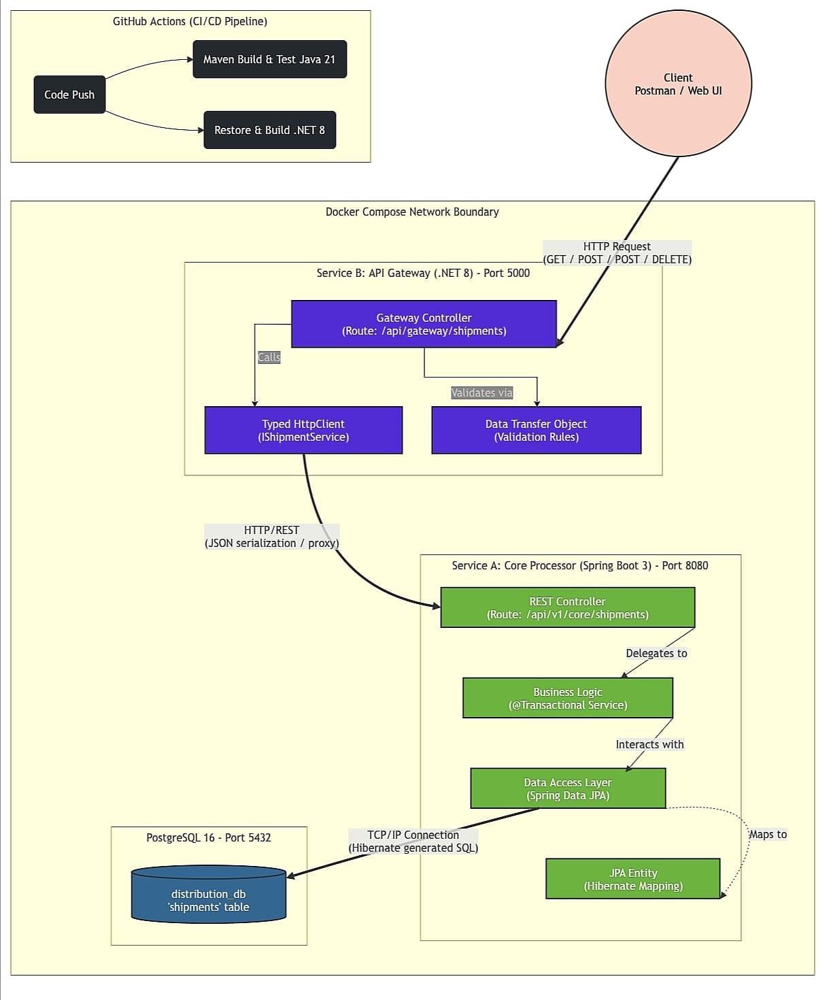

# Enterprise Distribution Gateway & Polyglot Microservices POC




A Proof of Concept (POC) demonstrating a polyglot microservices architecture. This project showcases how an enterprise can seamlessly integrate different technology stacks by utilizing a lightweight **.NET 8 API Gateway** at the edge to route requests to a robust **Spring Boot / Java 21 Core Service** backed by a **PostgreSQL** database.

---

## 📖 The Problem and The Solution

### The Problem
As enterprise software scales, organizations often find themselves locked into a single technology stack or struggling with a massive, tightly coupled monolith. Different engineering teams possess varying skill sets (e.g., C# vs. Java) and certain languages are better suited for specific tasks (e.g., .NET for high-throughput edge routing, Java/Spring for complex enterprise domain logic). 

### The Solution
A **Polyglot Microservices Architecture**. By decoupling the system into independent services communicating over standard HTTP/REST protocols, teams can choose the right tool for the job. 
In this POC:
- **.NET 8 (C#)** is utilized as the API Gateway. It acts as the single entry point for clients, providing a fast, lightweight layer capable of handling cross-cutting concerns (routing, rate limiting, edge validation).
- **Spring Boot 3 (Java 21)** is utilized as the Core Service. It handles the heavy lifting of domain business logic, data persistence, and transaction management.
- **Docker Compose** orchestrates the network, proving that language boundaries disappear when applications are properly containerized.

---

## 🛠️ Technology Stack

- **API Gateway:** .NET 8 (ASP.NET Core)
- **Core Business Service:** Java 21, Spring Boot 3, Spring Data JPA
- **Database:** PostgreSQL 16 (Alpine)
- **Containerization & Orchestration:** Docker, Docker Compose
- **Testing:** Postman Collection

---

## 🚀 Setup & Execution

### Prerequisites
- [Docker Desktop](https://www.docker.com/products/docker-desktop) installed and running.
- [Postman](https://www.postman.com/downloads/) (or any API client) installed for testing.

### Running the Application

1. **Clone the repository and navigate to the project root.**
2. **Build and start the containers using Docker Compose:**
   ```bash
   docker-compose up -d --build
   ```
3. **Verify the containers are running.** You should see three healthy containers:
   - `dist-api-gateway` (Exposed on port 5001)
   - `dist-core-service` (Internal on port 8080)
   - `dist-postgres` (Internal on port 5432)

### Testing the Workflow

You have two powerful options for testing the application:

#### Option 1: Swagger Web UI (Recommended)
This system comes with an interactive, built-in API documentation and testing interface.
1. Open your browser and navigate to: [http://localhost:5001/swagger](http://localhost:5001/swagger)
2. Expand any endpoint (e.g., `POST /api/gateway/shipments`).
3. Click **Try it out**, edit the JSON payload, and click **Execute**. The response will appear instantly.

#### Option 2: Postman Collection
A Postman collection (`postman_collection.json`) is included in the root directory. 
1. Open Postman.
2. Click **Import** > **File** and select `postman_collection.json`.

---

## 🏗️ Showcase Testing Scenario

To truly verify the value of this architecture and its enterprise-grade data schema, try the following scenario:

1. **Ingest a complex shipment:** Use the `POST /api/gateway/shipments` endpoint or Swagger UI to create a shipment with all realistic properties (`Origin`, `Weight`, `ExpectedDeliveryDate`). The .NET Gateway instantly proxy-validates and hands this off to Java.
2. **Retrieve the data:** Use `GET /api/gateway/shipments/{id}` to verify that the Java backend generated `createdAt` and `updatedAt` database timestamps automatically using JPA.
3. **Partial vs Full Updates:**
   - Execute a partial update using `PUT /api/gateway/shipments/{id}/status` or `/destination`. Notice how lightweight the operation is.
   - Execute a universal partial update using `PATCH /api/gateway/shipments/{id}` to dynamically change just a single field (like `"trackingNumber"`) using JSON Merge Patch functionality.
   - Execute a full entity update using `PUT /api/gateway/shipments/{id}` and modify the origin and weight entirely.
4. **Architectural Verification:** Check the Docker logs for the `core-service`. You will see the Java Spring Boot app securely processing business logic that was seamlessly handed off from the lightweight C# edge gateway.

---

## 💡 Architectural Justifications

- **Why .NET for the Gateway?** .NET 8 offers incredible performance improvements and minimal overhead, making it an excellent choice for a gateway that requires high throughput, low latency, and efficient request proxying.
- **Why Spring Boot for the Core?** The Java/Spring ecosystem excels at complex enterprise business logic, offering mature ORM solutions (Hibernate/JPA) and deep integration with enterprise data patterns.
- **Why PostgreSQL?** It is a robust, open-source, ACID-compliant relational database perfectly suited for handling structured shipment/transactional data.

---

## ⚠️ Limitations & Future Enhancements

As a Proof of Concept, this architecture is intentionally kept minimal to demonstrate cross-language interoperability. In a production environment, the following enhancements would be necessary:

1. **Security & Authentication:** Implementation of an Identity Provider (e.g., Keycloak or Auth0) using OAuth2/JWT for securing API endpoints at the gateway level.
2. **Service Discovery & Load Balancing:** Utilizing tools like Consul or Eureka so the API Gateway doesn't rely on hardcoded internal Docker DNS hostnames.
3. **Asynchronous Communication:** Introducing an event broker (e.g., Apache Kafka or RabbitMQ) for inter-service communication instead of synchronous HTTP calls, improving fault tolerance.
4. **Distributed Tracing & Observability:** Implementing OpenTelemetry, Zipkin, or Jaeger to track a single request as it jumps the boundary from the .NET gateway into the Java backend.
5. **Resilience Patterns:** Implementing circuit breakers (e.g., Polly for .NET or Resilience4j for Java) to prevent cascading failures if the core service becomes unresponsive.
